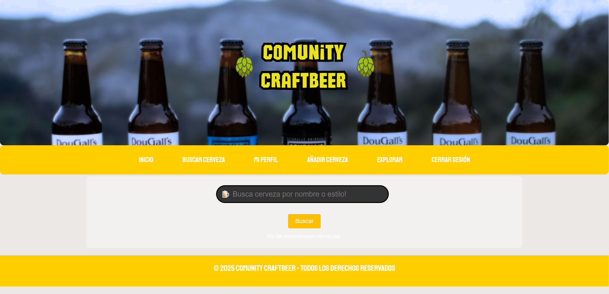
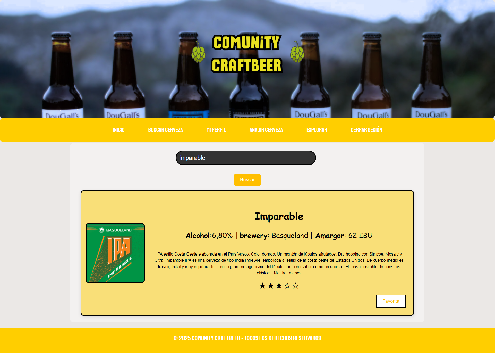
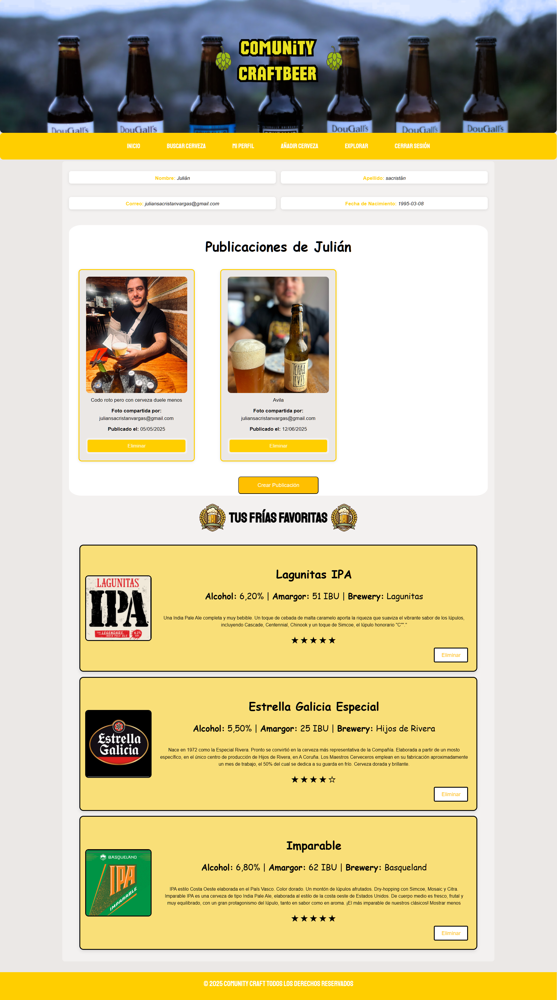

# Community CraftBeer

Community CraftBeer is a Java Spring Boot + MySQL web application designed for craft beer enthusiasts. Users can search and explore beers, add new entries, rate them with a star system, save favorites, and share their thoughts through publications.
---

## Tech Stack
- **Java 17** (works with 17+)  
- **Spring Boot 3**  
  - Spring MVC  
  - Spring Data JPA  
  - Thymeleaf  
  - **Spring Security (manual configuration)**  
- **MySQL** (with seed data of 100 beers)  
- **Maven**  
- **Bootstrap / CSS**

---

## Setup & Installation

1. **Clone the repository**:
   ```bash
   git clone https://github.com/juliandsv/Community-CraftBeer.git
   cd Community-CraftBeer
   ```


---

Configure the database:
Copy src/main/resources/application-example.properties → application.properties and fill in your local MySQL credentials.

---

Import the seed database (100 beers):

mysql -u YOUR_USER -p -e "CREATE DATABASE IF NOT EXISTS beerdb CHARACTER SET utf8mb4;"
mysql -u YOUR_USER -p beerdb < db/beerdb_seed.sql

---

Run the application:

mvn spring-boot:run

---

## Security

This project uses Spring Security with a manual configuration approach (no auto-generated login).

Custom login form (/login)

User roles and access restrictions defined programmatically

Passwords encrypted with BCrypt

Session-based authentication

---

## Features

-User authentication (Sping Security)

-Posts/Publications: create and view user publications

-Add new beers to the database via a form

-Beer search: browse beers from the seed database (100 items)

-Rating system: rate beers with a star-based score

-Favorites: save beers to your personal list of favorites

-User profile: check your ratings, favorites, and publications

-Responsive UI: optimized for desktop and mobile

---

##  Screenshots

##  Screenshots

### Login


### Beer Search


### Search Result


### User Profile


### Add Beer


