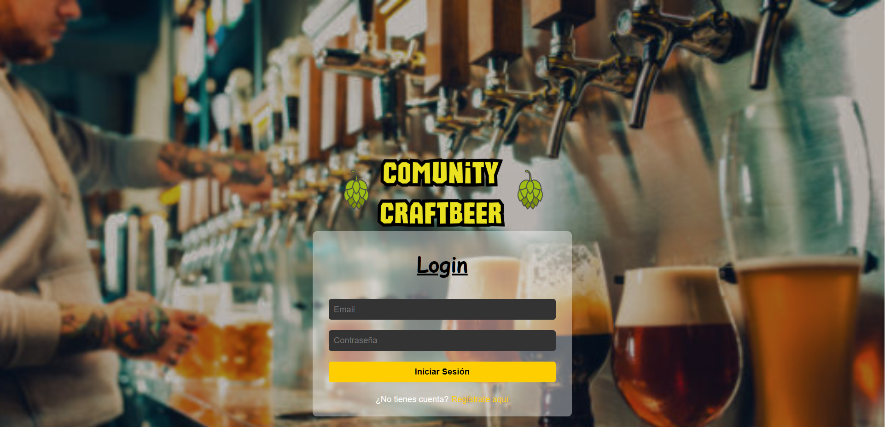
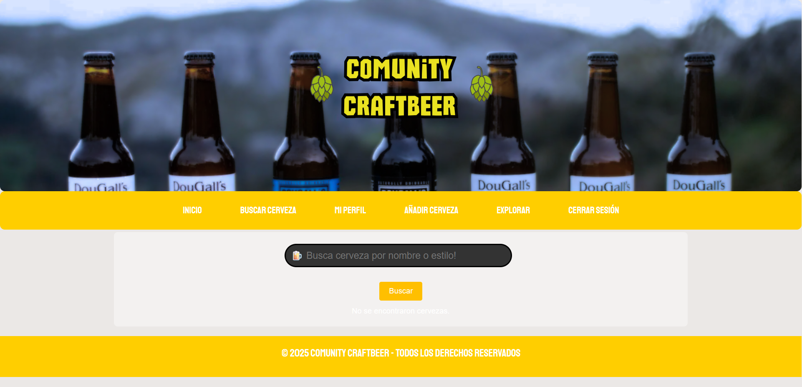
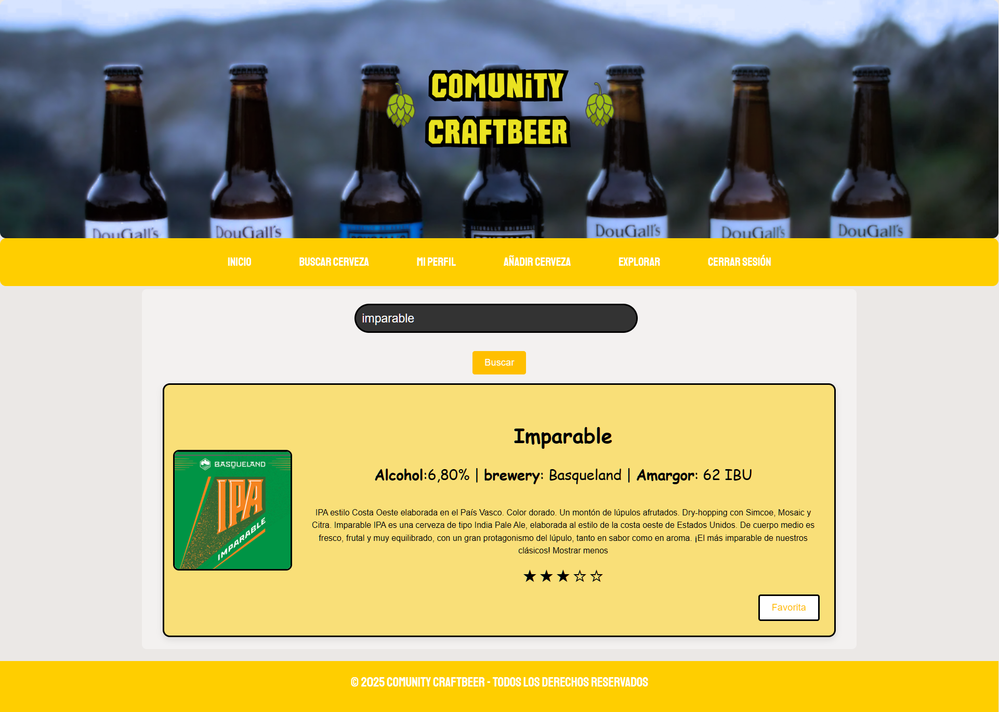
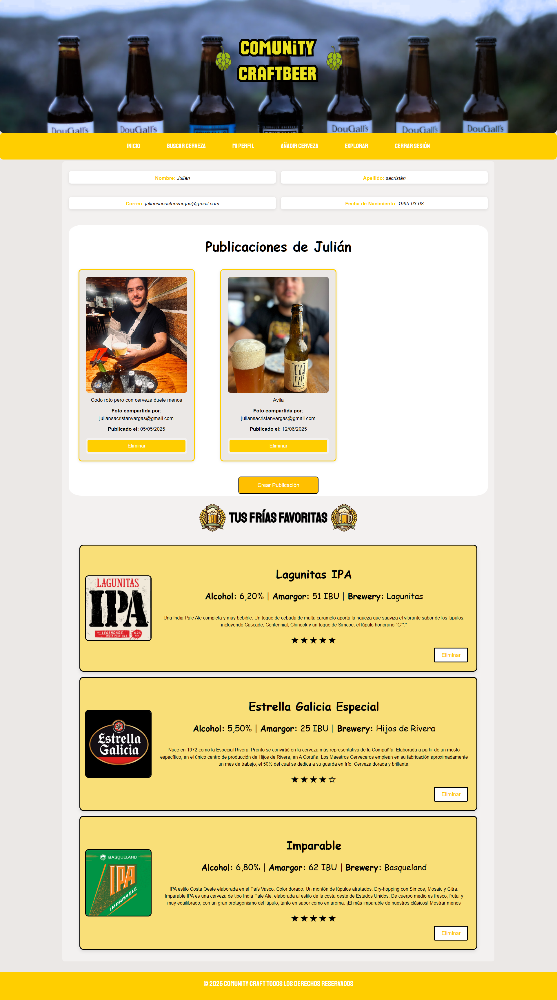
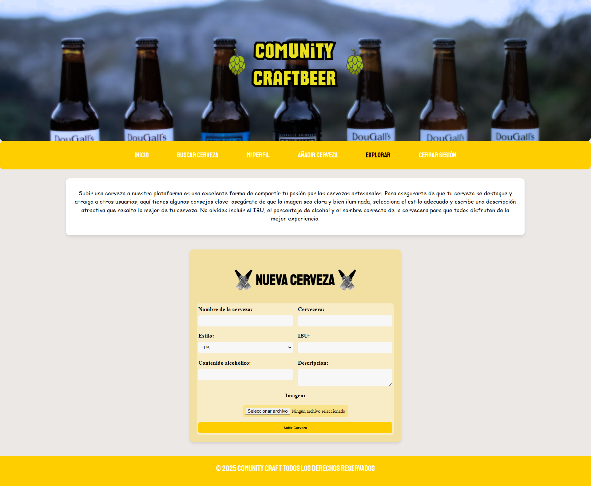

# 🍻 Community CraftBeer  

**Community CraftBeer** es una aplicación web desarrollada con **Java Spring Boot + MySQL** pensada para los amantes de la cerveza artesanal.  
Los usuarios pueden **buscar y explorar cervezas**, **añadir nuevas cervezas a la BBDD**, **valorarlas con un sistema de estrellas**, **guardarlas como favoritas** y **compartir fotos** mediante publicaciones.  

---

## 🚀 Tecnologías utilizadas  

* **Java 17** (compatible con 17+)  
* **Spring Boot 3**  
* **Spring MVC**  
* **Spring Data JPA**  
* **Thymeleaf**  
* **Spring Security** (configuración manual)  
* **MySQL** (incluye datos de prueba con 100 cervezas)  
* **Maven**  
* **CSS**  

---

## Setup & Installation

1. ## ⚙️ Instalación y configuración  

1. **Clonar el repositorio:**  
   ```bash
   git clone https://github.com/juliandsv/Community-CraftBeer.git
   cd Community-CraftBeer

---

2.**Configurar la base de datos:**
Copia el archivo: **src/main/resources/application-example.properties**
y renómbralo como: **application.properties**
Completa con tus credenciales locales de MySQL.

---

3.**Importar la base de datos inicial (100 cervezas):**
mysql -u TU_USUARIO -p -e "CREATE DATABASE IF NOT EXISTS beerdb CHARACTER SET utf8mb4;"
mysql -u TU_USUARIO -p beerdb < db/beerdb_seed.sql

---

4.**Ejecutar la aplicación:**
mvn spring-boot:run

---

## 🔒 Security
Este proyecto utiliza Spring Security con configuración manual (no se usa el login generado por defecto).

  1.Formulario de login personalizado: /login
  
  2.Contraseñas encriptadas con BCrypt
  
  3.Autenticación basada en sesión

---

## ✨ Funcionalidades

  🔑 Autenticación de usuarios (Spring Security)
  
  📝 Publicaciones: crear y ver publicaciones de otros usuarios

  🍺 Añadir nuevas cervezas mediante formulario

  🔍 Buscador de cervezas (base de datos inicial con 100 entradas)

  ⭐ Sistema de puntuación con estrellas

  ❤️ Favoritos: guarda cervezas en tu lista personal

  👤 Perfil de usuario: consulta tus valoraciones, favoritos y publicaciones

  📱 Interfaz responsive (adaptada a escritorio y móvil)

---

##  Screenshots

##  Screenshots

### Login


### Beer Search


### Search Result


### User Profile


### Add Beer


